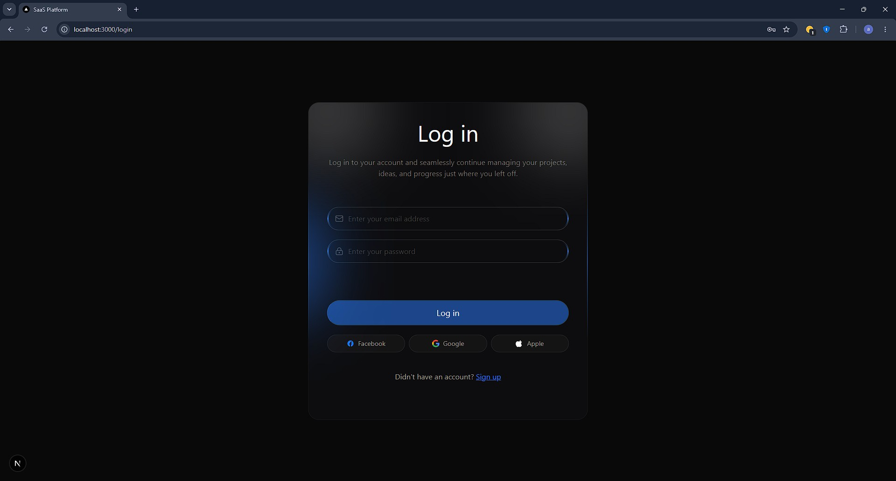
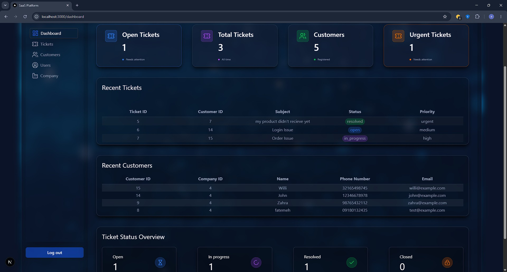
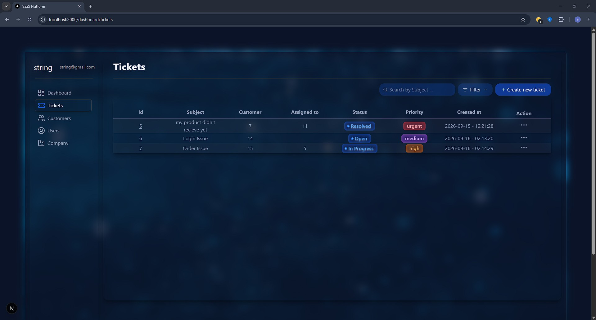
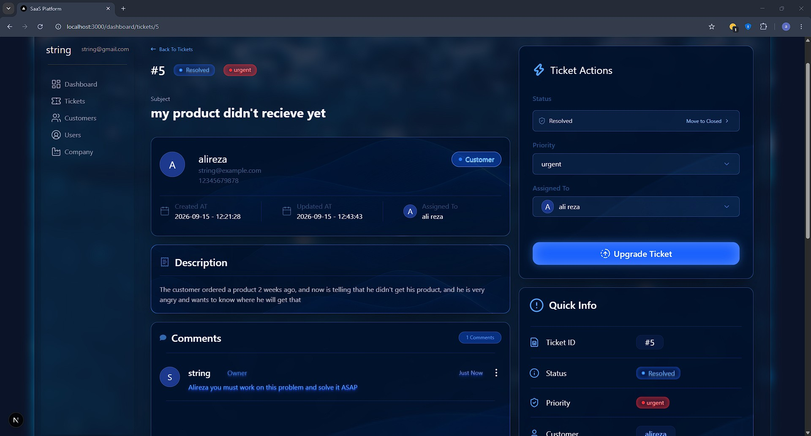
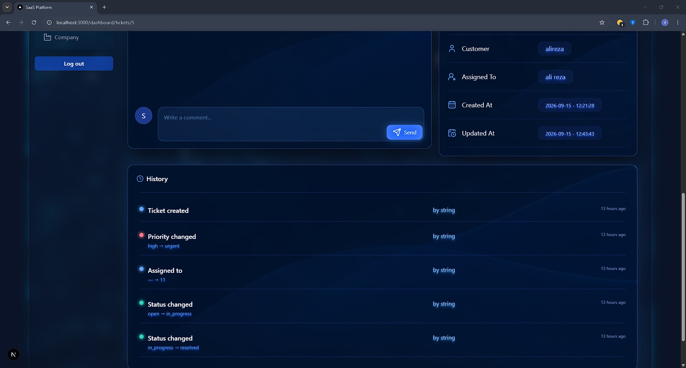
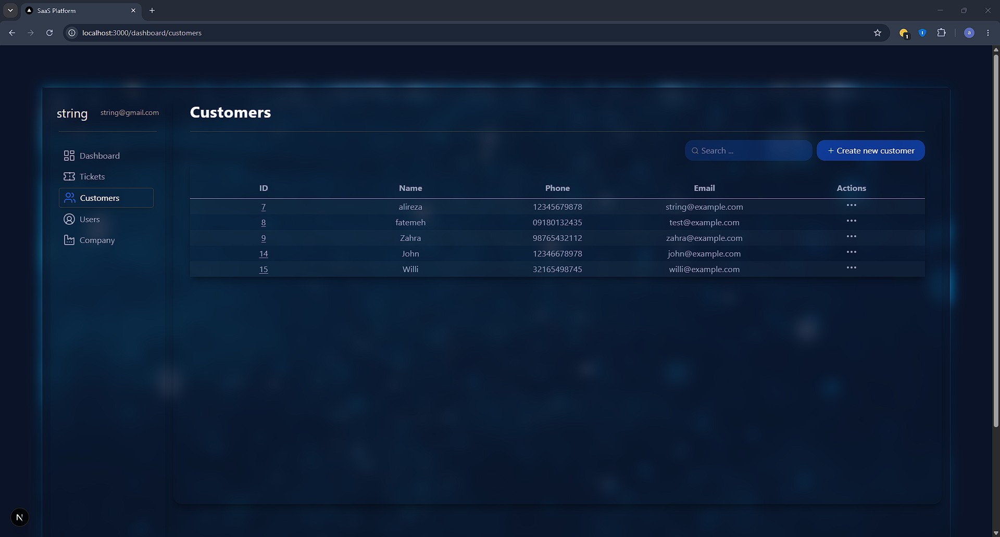
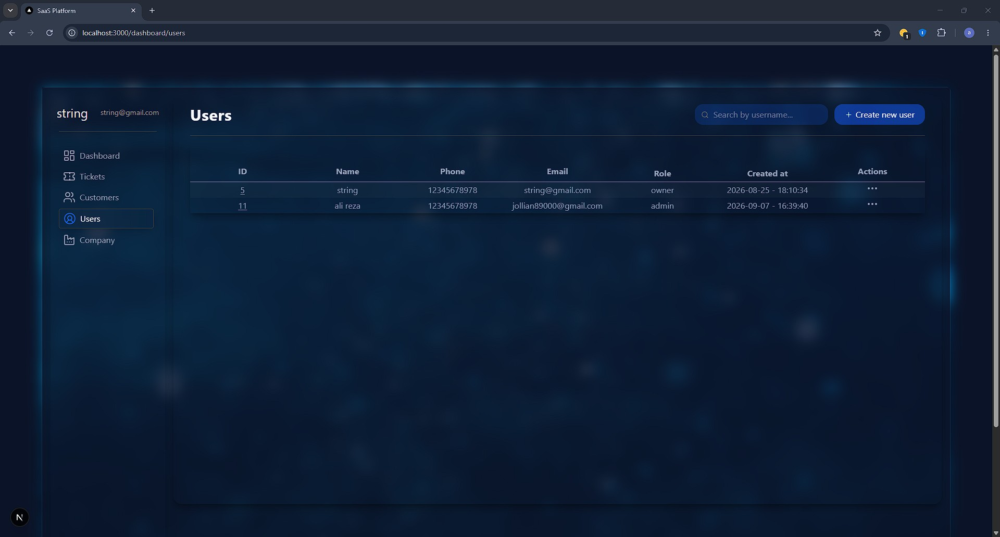
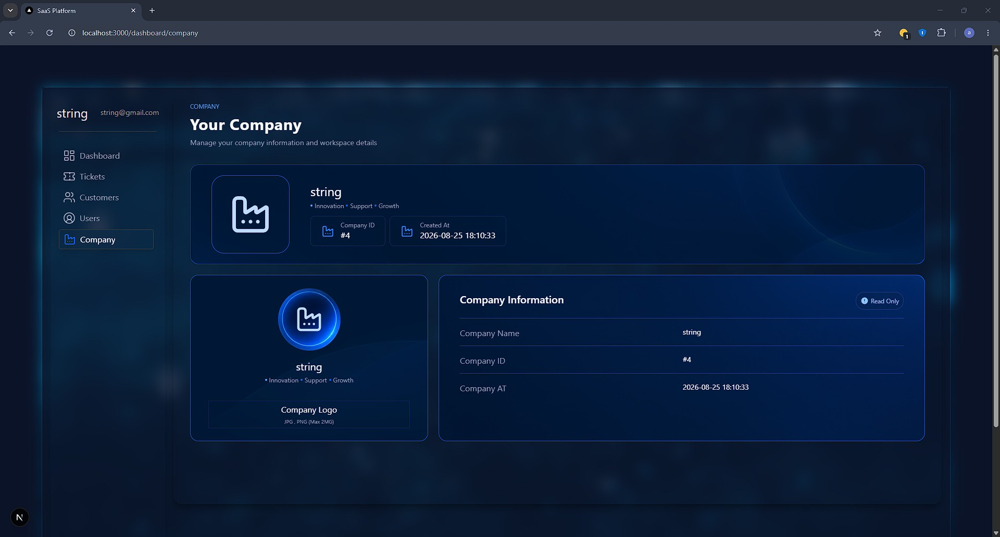

# SaaS Support Platform

A multi-tenant customer support ticketing platform built with FastAPI and Next.js.

SaaS Support Platform allows companies to manage support tickets, customers, users, comments, and ticket activity history in an isolated company-based environment.

---

## Screenshots

### Login



### Dashboard



### Tickets



### Ticket Details





### Customers



### Users



### Company



---

## Features

### Authentication & Authorization

- JWT-based authentication
- Role-based access control
- Company-level data isolation
- Owner, Admin, and Member roles

### Ticket Management

- Create and manage support tickets
- Ticket status and priority management
- Assign tickets to users
- Customer-ticket relationship
- Ticket activity history
- Soft deletion
- Pagination
- Search and filtering

### Customer Management

- Create and manage customers
- Customer-ticket relationships
- Company-level customer isolation
- Pagination
- Search and filtering

### User Management

- Company-based user management
- Role management
- User assignment to tickets

### Comments & History

- Ticket comments
- Soft deletion for comments
- Ticket activity history
- Track field changes with old and new values

### Frontend

- Responsive dashboard
- Dark glassmorphism UI
- Animated interactions with Framer Motion
- Toast notifications
- Pagination
- Search and filtering

---

## Tech Stack

### Backend

- **FastAPI** — REST API
- **SQLAlchemy** — ORM and database interaction
- **PostgreSQL** — Relational database
- **Alembic** — Database migrations
- **Pydantic** — Data validation and schemas
- **JWT** — Authentication
- **Pytest** — Backend testing

### Frontend

- **Next.js** — React framework
- **React** — User interface
- **TypeScript** — Type-safe frontend development
- **Tailwind CSS** — Styling and responsive UI
- **Framer Motion** — UI animations
- **Axios** — HTTP client

---

## Architecture

SaaS Support Platform follows a separated frontend and backend architecture.

```text
┌──────────────────────┐
│       Next.js        │
│       Frontend       │
│                      │
│  React + TypeScript  │
│    Tailwind CSS      │
│    Framer Motion     │
└──────────┬───────────┘
           │
           │ HTTP / REST API
           ▼
┌──────────────────────┐
│       FastAPI        │
│       Backend        │
│                      │
│   Authentication     │
│   Authorization      │
│   Business Logic     │
│   Validation         │
└──────────┬───────────┘
           │
           │ SQLAlchemy
           ▼
┌──────────────────────┐
│     PostgreSQL       │
│      Database        │
└──────────────────────┘
```

The backend is responsible for authentication, authorization, business logic, validation, database operations, and API endpoints.

The frontend communicates with the backend through REST APIs and provides the user interface for managing the support platform.

---

## Project Structure

### Backend

```text
backend/
├── alembic/
├── app/
│   ├── core/
│   ├── database/
│   ├── models/
│   ├── routes/
│   ├── schemas/
│   ├── services/
│   ├── __init__.py
│   └── main.py
├── tests/
├── alembic.ini
└── requirements.txt
```

### Frontend

```text
frontend/
├── app/
├── components/
├── contexts/
├── lib/
├── public/
├── types/
├── package.json
├── next.config.ts
├── tailwind.config.js
└── tsconfig.json
```

---

## Authentication & Authorization

The application uses JWT-based authentication for secure user access.

After successful login, the backend issues an access token that is used to authenticate subsequent API requests.

Each user belongs to a company, and access to company-related data is isolated based on the authenticated user's company.

### User Roles

| Role | Description |
|------|-------------|
| Owner | Full access to company resources and administrative operations |
| Admin | Administrative access to company resources |
| Member | Standard access to support operations |

Role-based authorization is enforced on the backend for protected operations.

---

## Core Modules

### Users

The user management system provides:

- User creation and management
- Role management
- Company-based user isolation
- User assignment to tickets
- Role-based permissions

### Customers

The customer management system provides:

- Customer creation
- Customer updates
- Customer deletion
- Customer information management
- Company-based customer isolation
- Customer-ticket relationships
- Pagination
- Search and filtering

### Tickets

The ticket management system provides:

- Ticket creation
- Ticket updates
- Ticket deletion
- Status management
- Priority management
- User assignment
- Customer association
- Search and filtering
- Pagination
- Soft deletion
- Activity history

### Comments

Users can communicate through ticket comments.

The comment system supports:

- Creating comments
- Viewing ticket comments
- Deleting comments
- Soft deletion

### History

Ticket changes are tracked through an activity history system.

The history records information such as:

- User who performed the action
- Changed field
- Previous value
- New value
- Action type
- Timestamp

This provides an audit trail for ticket changes.

### Company

Each company has its own isolated users, customers, and tickets.

The company module provides access to company information associated with the authenticated user.

---

## API Documentation

The backend is built with FastAPI and provides interactive API documentation through Swagger UI.

After starting the backend server, open:

```text
http://127.0.0.1:8000/docs
```

The API is organized around the following modules:

- Authentication
- Users
- Companies
- Customers
- Tickets
- Comments
- History

---

## Getting Started

### Requirements

Before running the project, make sure the following are installed:

- Python 3.11+
- PostgreSQL
- Node.js
- pnpm

### 1. Clone the Repository

```bash
git clone https://github.com/zakerian-dev/SaaS-Support-Platform.git
cd SaaS-Support-Platform
```

### 2. Backend Setup

Navigate to the backend directory:

```bash
cd backend
```

Create a virtual environment:

```bash
python -m venv venv
```

Activate the virtual environment.

#### Windows

```bash
venv\Scripts\activate
```

#### Linux / macOS

```bash
source venv/bin/activate
```

Install the backend dependencies:

```bash
pip install -r requirements.txt
```

Create a `.env` file inside the `backend` directory and configure the required environment variables.

Run the database migrations:

```bash
alembic upgrade head
```

Start the FastAPI development server:

```bash
uvicorn app.main:app --reload
```

The backend will be available at:

```text
http://127.0.0.1:8000
```

### 3. Frontend Setup

Open a new terminal and navigate to the frontend directory:

```bash
cd frontend
```

Install the dependencies:

```bash
pnpm install
```

Start the Next.js development server:

```bash
pnpm dev
```

The frontend will be available at:

```text
http://localhost:3000
```

---

## Environment Variables

### Backend

Create a `.env` file inside the `backend` directory:

```env
DATABASE_URL=your_database_url
SECRET_KEY=your_secret_key
ALGORITHM=HS256
ACCESS_TOKEN_EXPIRE_MINUTES=60
```

### Frontend

Create a `.env.local` file inside the `frontend` directory:

```env
NEXT_PUBLIC_API_URL=your_api_url
```

Never commit `.env` or `.env.local` files containing secrets or private configuration to the repository.

---

## Database & Migrations

The project uses PostgreSQL as its relational database.

SQLAlchemy is used for ORM and database interaction, while Alembic manages database schema migrations.

### Apply Migrations

```bash
alembic upgrade head
```

### Create a Migration

After making changes to the database models:

```bash
alembic revision --autogenerate -m "your migration message"
```

Review the generated migration before applying it.

---

## Testing

Backend tests are written using Pytest.

Run the test suite with:

```bash
pytest
```

The test suite covers core backend functionality including authentication, users, companies, customers, and tickets.

---

## Future Improvements

Possible future improvements include:

- Email notifications
- File attachments
- Advanced ticket filtering
- Analytics and reporting
- Real-time ticket updates
- AI-powered customer support features

---

## Author

**Alireza Zakerian**

GitHub: [zakerian-dev](https://github.com/zakerian-dev)